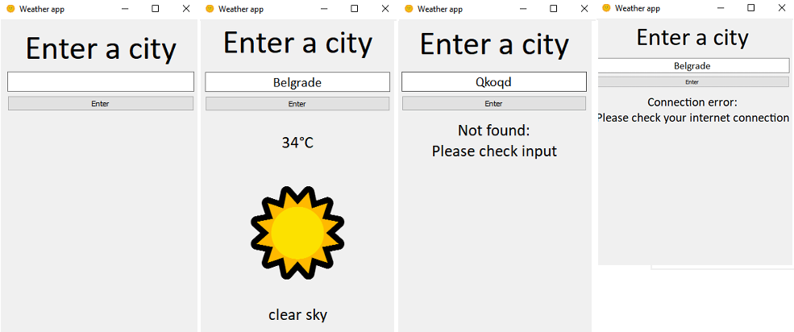

# PyQt5 Weather Application

A simple desktop weather application built with Python and PyQt5 that retrieves real-time weather data from the OpenWeatherMap API. The app allows users to enter a city name and displays the current temperature, weather description, and a corresponding emoji for better visualization.

# Features

- User-friendly PyQt5 graphical interface
- Real-time weather data using OpenWeatherMap API
- Temperature displayed in Celsius
- Weather description and emoji-based visualization
- Error handling for invalid city names and network issues

# Testing

The application was tested under the following conditions:
- Application launch (default state)
- Valid city input
- Invalid city input
- No internet connection

  

# Application Flow

1. User launches the application  
2. User enters a city name  
3. Application validates input  
4. Weather data is fetched from the API  
5. Temperature, description, and emoji are displayed  
6. Errors are shown if input or connection fails

# Future Improvements

- Multi-day weather forecast
- Additional data (humidity, wind speed, sunrise/sunset)
- Automatic refresh using timers
- Multi-language support
- Packaging as a standalone executable
